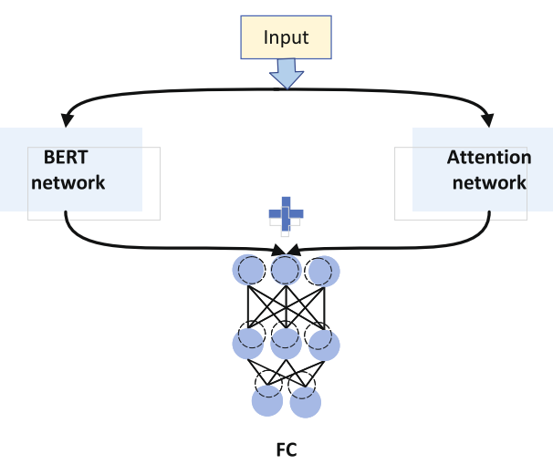
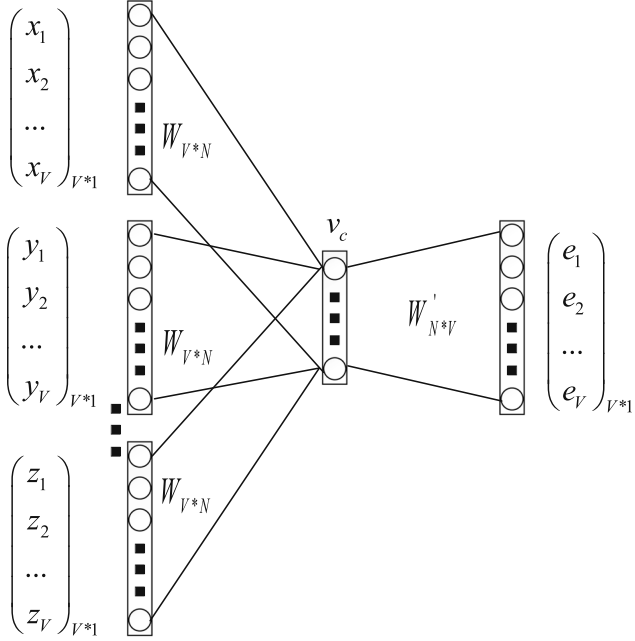

# **A joint attention enhancement network for text classification applied to citizen complaint reporting**

**Yuanhang Wang1 · Yonghua Zhou1 · Yiduo Mei ``2 ``**

Accepted: 27 January 2023 © The Author(s), under exclusive licence to Springer Science+Business Media, LLC, part of Springer Nature 2023 / Published online: 1 March 2023

## **Abstract**

Citizen complaint classification plays an important role in the construction of the smart city. For text data, the most expressive semantic information is reflected in the keyword of the text. With the proposed Transformer structure and further expansion of the model structure, natural language processing has embarked on a path of fine-tuning the pre-trained model based on the multi-headed attention mechanism. Although the above method works well, it further deepens the black box model of the network. To verify whether the multi-headed attention mechanism adds enough attention to the keyword information, this paper proposes a joint attention enhancement network that places the attention mechanism outside the main network model. This paper uses the idea of lexical frequency statistics to obtain keyword information through the macroscopic use of corpus contents and improves the attention through knowledge incorporation based on soft attention. In this paper, a comparison experiment is performed by the current hot open-source network models on Hugging Face. Experiments show that the proposed model improves about 10%-20% in accuracy compared with the different original models, while the network training time only increases about 5%. The joint enhancement network can identify the key region of input data more accurately and converge quickly.

**Keywords** Citizen complaint · Pre-trained model · Multi-headed attention mechanism · Soft attention · Knowledge incorporation

# **1 Introduction**

With the continuous exploration and development of urban brains, how to improve the efficiency of urban governance has become a hotspot in the field of smart city construction [\[1\]](#page-9-0). In the process of urban governance, city government departments often receive a large amount of information from citizens' reports and complaints, which are mostly presented in the form of texts or voices with a variety of types and semantic features, and often involve many

- Yonghua Zhou [yhzhou@bjtu.edu.cn](mailto: yhzhou@bjtu.edu.cn)

> Yuanhang Wang [21125097@bjtu.edu.cn](mailto: 21125097@bjtu.edu.cn)

Yiduo Mei [meiyd@zhongguancun.com.cn](mailto: meiyd@zhongguancun.com.cn)

1  School of Electronic and Information Engineering, Beijing Jiaotong University, Beijing, 100044, China

2 Zhongguancun Smart City Co., Ltd, Beijing, 100071, China

different scenarios in cities [\[2\]](#page-9-1). Therefore, how to classify citizens' complaints accurately is an important task to promote the modernization of urban governance [\[3\]](#page-9-2).

As one of text classification tasks, the classification of citizen complaint cases involve text data that relies heavily on keyword information to express the semantic information of whole cases [\[4\]](#page-9-3). For example, there exists statement A, representing that citizens reported that the lamp I purchased at Starling Street did not light up; there exists statement B, expressing that citizens reported that I saw the lamp at Starling Street did not light up. The overall structures of the two sentences are similar, but the appearances of special keywords have changed the whole semantics dramatically. The A statement should be sent to the consumer association to solve, and the B statement should be sent to the neighborhood grassroots committee to solve. Citizen complaint cases differ from other text classification tasks in that some cases have blurred boundaries, and can be handled by multiple departments, which undoubtedly makes classification tasks more challenging.

Traditional text classification models, such as RNN, LSTM, and Bi-LSTM models, tend to mine the semantics of entire sentences in the form of word vectors, thus neglect paying attention to different words in the entire sentence learning [\[5–](#page-9-4)[7\]](#page-9-5). Although the structure of the Transformer is based on attention mechanism [\[8\]](#page-9-6), it does not ensure whether the model adds enough attention and lacks the macroscopic utilization of the whole corpus. Due to the characteristics of citizen complaint cases, such as many incident scenarios, fuzzy classification boundaries, and reliance on keywords to express information, it is uneasy to obtain good classification results. To solve this problem, a joint attention enhancement network based on pre-trained model is proposed, which utilizes macro knowledge and adopts the idea of knowledge incorporation. The main work of this paper is described as follows:

- We propose a method for mining keyword information using the corpus. Through word frequency statistics, derive information about the importance of different words, and then, vector representation of sentence keyword information is given through soft attention mechanism.
- We propose a joint attention enhancement network based on pre-trained model. We use a parallel dual network to accomplish semantic extraction tasks and attention enhancement on key information in a sentence.
- Comparative experiments are performed on numerous mainstream pre-trained models. The experiments demonstrate that the proposed model can improve the classification accuracy by about 10% to 20% with essentially the same training time.

## **2 Related work**

The research of natural language processing drives the continuous development and breakthrough in language intelligence. Text classification is one of mainstream areas in natural language processing, focusing on intelligent conversation and topic recommendation.

In this chapter, Section [2.1](#page-1-0) introduces the existing text classification methods, Section [2.2](#page-1-1) describes the attention mechanism, and Section [2.3](#page-2-0) describes the pre-trained models.

## **2.1 Text classification methods**

Maron published the first article on automatic text classification in 1961 [\[9\]](#page-9-7). Since then, many text classification methods were proposed, which are integrated with statistical ideas, such as rule-based method using decision tree model (DTM), probability-based method using naive Bayesian model (NBM), statistical method using k-nearest neighbor (KNN) algorithm, and geometric partitioning method using support vector machine (SVM). These methods have the advantage of being applied to the cases with relatively small data, but have the disadvantage of poor generalization ability.

In recent years, with the rapid development of neural networks in artificial intelligence, natural language processing has also ushered in a new era. It advanced from the very first convolutional neural network (CNN), which extracts sentence semantics by the simplest convolution operation, to the later proposed recurrent neural network (RNN), a temporal language model, which can stores semantic information of the sentence temporarily. The long short-term memory (LSTM) solves the long dependency problem of the RNN network. The BiLSTM inputs the text information into a forward LSTM and a backward LSTM at the same time, and adds their results, so as to extract the contextual semantics of the text simultaneously. These models have been effectively applied to text classification. For example, Kim [\[10\]](#page-9-8) proposed TextCNN for the first time and successfully used it for text classification. Xie et al. [\[11\]](#page-9-9) used two-layer LSTM and CNN modules to implement a feature-enhanced fusion model to enhance the text features extracted from the attention mechanism. Li et al. [\[12\]](#page-9-10) proposed a CNN model by adding attention mechanism and combining contextual semantics, to achieve user attribute classification. Yan et al. [\[13\]](#page-9-11) used BiLSTM+CRF model to obtain text entity information and achieve multi-label text classification. Liu et al. [\[14\]](#page-9-12) proposed an attention-based BiGRU+CNN network, combining location features and attention mechanism in CNN, which were verified on Chinese text datasets. Wu et al. [\[15\]](#page-9-13) improved the CNN model, using an implicit weighting method to complete feature extraction, and achieve good results on several datasets.

Due to the advent of the Internet era, computing resources are growing rapidly. It is difficult for these traditional models and methods to have further improvement in effectiveness. Therefore, some mega models have emerged and become the mainstream research direction in the field of natural language processing.

## **2.2 Attention mechanism**

The attention mechanism is popular in the public [\[16\]](#page-9-14), based on the principle that when human eyes see something, they always attach attention to some significant features of the object, so it is hoped that the networks can also pay attention to the key information during training. Bahdanau et al. [\[17\]](#page-9-15) used the attention mechanism to implement machine translation, and applied it to natural language processing for the first time. Since then, the attention mechanism has shown its excellent advantages to everyone. The proposed Transformer structure advances the attention mechanism to a new level, which adopts an approach of multi-head attention mechanism, thus providing the network with stronger learning ability. On this basis, Wu et al. [\[18\]](#page-9-16) accomplished sentiment text classification by designing shallow and deep networks and constructing positional attention mechanisms. Qiao et al. [\[19\]](#page-9-17) proposed a model to add different attention mechanisms for different representations of Chinese. Catelli et al. [\[20\]](#page-9-18) proposed to combine contextualized word representation on the basis of Bi-LSTM+CRF architecture to achieve clinical de-identification.

All of the above studies are extensions of the attention mechanism and have achieved good results. Due to the good performance of the attention mechanism, more and more scholars are conducting research on it.

## **2.3 Pre-trained models**

With the further development of AI technology and the growing size of required computing power resources, the emergence of some mega models makes it difficult to train networks from scratch. As a result, pre-trained models have emerged. Instead of requiring researchers to train network models from scratch for each task, they only require a small amount of training on top of the pre-trained models with their datasets to achieve good results. Many scholars have done related research about pre-trained models. For example, Wu et al. [\[21\]](#page-9-19) enhanced the dataset by smoothing the one-hot encoding of words based on the pre-trained model, thus achieving good training results with small data. Zhu et al. [\[22\]](#page-9-20) proposed a multi-semantic learning model under BERT and combined it with CNN to extract finer-level semantic information. Li et al. [\[23\]](#page-9-21) analyzed stock reviews by connecting network structures such as LSTM and CNN under a pre-trained model. Catelli et all. [\[24\]](#page-9-22) applied BERT to transfer learning from high-resource languages to low-resource languages, and achieved an important performance increase. Pota et al. [\[25\]](#page-9-23) employed BERT to represent the information hidden in symbols, and performed experiments to achieve sentiment analysis. Guarasci et al. [\[26\]](#page-10-0) investigated the ability of BERT model to transfer syntactic knowledge cross-lingually. Catelli et al. [\[27\]](#page-10-1) built a deceptive review detector aided by sentiment awareness under BERT model to distinguish the deceptive reviews.

Pre-trained models have become the most popular method of model training in the field of natural language processing. As a result, there are a lot of studies for pre-trained models, but most of these studies lack the utilization of corpus. Therefore, we conducted research in this direction.

## **3 Keyword enhancement model**

The BERT [\[28\]](#page-10-2) network model uses the Transformer as a basic structure to learn textual keyword information by a multi-head attention mechanism. It is formulated as follows:

$$
Attention(\mathcal{Q}, K, V) = softmax\left(\frac{\mathcal{Q}K^T}{\sqrt{d\_k}}\right)V,\tag{1}
$$

where *Q*, *K*, and *V* represent Query, Key, and Value respectively. The idea is to compute the Attention Value by giving a task-related query vector *Q* and then computing the attention distribution with the Key and attaching it to the Value. Although the interpretation about *Q*, *K*, and *V* matrices is reasonable, it does not ensure whether the model adds enough attention to sentence. Therefore, a joint attention enhancement network is proposed in this study, as shown in Fig. [1,](#page-2-1) instead of relying solely on the attention mechanism of the BERT network,

The joint attention enhancement network treats the BERT network as a text semantic extraction model, reestablishes the external attention network, and splits the semantic extraction and attention enhancement into two subtasks. It combines the outputs of two models by vector fusion in the downstream of the network, and feeds them directly into the fully connected (FC) layer for classification, in order to enhance the keyword information and improve the network classification accuracy.

In this chapter, Section [3.1](#page-3-0) introduces the method of word vectorization, Section [3.2](#page-3-1) describes how to establish the keyword information dictionary, and Section [3.3](#page-4-0) describes the method of keyword information enhancement. In Section [3.4,](#page-6-0) we give a summary of the derived model.

**Fig. 1** Simplified diagram of network structure

## **3.1 Text vectorization**

To enable the network to understand the input text data, it is necessary to vectorize the text data. Traditional word vector representation methods, such as the one-hot model, use a relatively independent representation between words, creating a vector equal to the length of a dictionary, and representing the word with a vector whose corresponding position is 1 and whose other positions are 0. If there are 20,000 different words in the entire corpus, then the dimension of the word vector is 20,000. Therefore, an obvious disadvantage of this approach is the dimension explosion and the large amount of required computational power. The biggest drawback of this approach lies in ignoring the relevance of words to each other, because the semantics of text data is expressed by the meanings of words and the connections among words.

Word2vec is a model that compresses the word vector dimension and incorporates the relationship among words [\[29\]](#page-10-3), including the skip-gram model, predicting context by current Word, and the continuous bag of words (CBOW) model, predicting the word by inputting the contextual word, as shown in Fig. [2.](#page-3-2)

In Fig. [2,](#page-3-2) vector *e* is the one-hot encoding of predicted words, vectors *x*, *y*, and *z* are the one-hot encoding of contextual words, WV  * N  and W ' N * V   are the mapping matrices, and vector *vc* is the word embedding vector of the requested word. The dimension of the word embedding vector can be modified by setting the mapping matrix.

**Fig. 2** CBOW model structure

## **3.2 Establishment of keyword information dictionary**

Due to the nature of citizen complaint data relying on keyword information, this paper gives a method to obtain keyword information using the corpus.

Term frequency-inverse document frequency (TF-IDF) is a word frequency statistics method to evaluate the importance of a word for the current document [\[30\]](#page-10-4). Obviously, if the word appears in a document almost as many times as it appears in the whole corpus, then this word is most likely to be regarded as a keyword for that document. Thus, the importance of a word is proportional to the number of its occurrences in the document and inversely proportional to the frequency of its occurrence in the corpus.

The term frequency (TF) indicates how often a word appears in the document. To ensure that the word frequency does not produce a large value due to a large number of words in the document, normalization is required, as shown below:

$$
\ln f\_{ij} = \frac{n\_{ij}}{\sum\_{k} n\_{k,j}},\tag{2}
$$

where *nij* is the number of occurrences of word *wi* in document *dj* , and the denominator is the sum of the number of words that appear in document *dj* .

The inverse document frequency (IDF) of a word can be represented by dividing the total number of documents by the number of documents containing the word, and then logging the result. The logarithm is used to reduce the absolute value of the IDF for different words. Obviously, if the number of documents containing a word is smaller, the larger the IDF is, the better the word is in terms of category differentiation. The IDF is formulated as

$$
idf\_l = \log \frac{|\mathcal{D}|}{1 + |\left\{ j : w\_l \in d\_j \right\}|},\tag{3}
$$

where |D| is the total number of documents in the corpus and | *j* : *wi* ∈ *dj* | denotes the number of documents containing the word *wi*. If the word is not in the corpus, it will lead to a zero denominator, so 1 + | *j* : *wi* ∈ *dj* | is used in general. Thus, the complete TF-IDF metric can be derived by the following equation:

$$
\text{tf } \dot{\bot}df = tf \ast idf = \frac{n\_{ij}}{\sum\_{k} n\_{k,j}} \ast \log \frac{|\mathcal{D}|}{1 + |\left\{ j \,:\, w\_{l} \in d\_{j} \right\}|}. \tag{4}
$$

To make macro use of the citizen reporting data, this study first splices all the training data by category, and each category is used as one document, but Chinese data needs to be pre-cut. Since there are 73 categories in the dataset, 73 category documents are obtained, and the sum of these 73 category documents is the overall corpus. After building the category documents and the corpus, we solve the TF-IDF value for all words in each category document by the TF-IDF method, and we get 73 category dictionaries:

$$
\begin{cases} d\_1: \left\{ w\_1: t\_{1,1}; w\_2: t\_{1,2}; w\_3: t\_{1,3}; w\_4: t\_{1,4}; \dots; w\_a: t\_{1,a} \right\} \\ d\_2: \left\{ w\_1: t\_{2,1}; w\_2: t\_{2,2}; w\_3: t\_{2,3}; w\_4: t\_{2,4}; \dots; w\_b: t\_{2,b} \right\} \\ \cdot \\ \cdot \\ d\_{73}: \left\{ w\_1: t\_{73,1}; w\_2: t\_{73,2}; w\_3: t\_{73,3}; w\_4: t\_{73,4}; \dots; w\_c: t\_{73,c} \right\} \end{cases} \tag{5}
$$

where *di* represents the category dictionary, *wi* is the word that appears in the corresponding category, *ti,j* is the TF-IDF value corresponding to *wi*, a, b and c are the length of different dictionaries. Since the category dictionaries are not of the same length, it has a corresponding TF-IDF value of 1-73 for each word in the corpus, which is obviously not what we expect. To unify the 73 category dictionaries, a total of two approaches are considered in this study. We use the average retention method and the maximum retention method, as shown by [\(6\)](#page-4-1) and [\(7\)](#page-4-1), respectively:

$$
d\left[w\_{l}\right] = \text{average}\left(d\_{l}\left[w\_{l}\right] + d\_{2}\left[w\_{l}\right] + d\_{3}\left[w\_{l}\right] + \cdots\right)
$$

$$
+ d\_{n}\left[w\_{l}\right]),\tag{6}
$$

$$
d\left[w\_{l}\right] = \max\left(d\_{l}\left[w\_{l}\right], d\_{2}\left[w\_{l}\right], d\_{3}\left[w\_{l}\right], \dots, d\_{n}\left[w\_{l}\right]\right). \left(7\right)
$$

In the average retention method, the final TF-IDF value of a word is obtained by summing and averaging the TF-IDF values of the corresponding words in the 73 category dictionaries. However, due to the nature of keywords, they only appear more often in a given document, so the disadvantage of this method is that it dilutes the keyword information.

In the maximum retention method, by comparing the TF-IDF values of the same word in different categories of dictionaries, the maximum value is retained. Obviously, since keywords rarely appear in irrelevant categories, this method not only does not dilute the keyword information, but also serves to reduce the probability of negative samples which are the words in categories with smaller TF-IDF values.

To obtain different keyword information, firstly, this study builds up the category documents and the overall corpus and finds 73 category dictionaries by using the TF-IDF method. Secondly, the keyword information dictionary of the whole corpus is found by unifying the 73 category dictionaries through the maximum retention method. We employ the TF-IDF dictionary for keyword information enhancement.

## **3.3 Keyword information enhancement**

In order to represent the input text, the following method is generally used:

$$
v\_H = \text{average}\left(\begin{pmatrix} x\_1 \\ x\_2 \\ \vdots \\ \cdot \\ \cdot \\ \cdot \\ \cdot \\ \text{\(\mathcal{Y}\)} \end{pmatrix} + \begin{pmatrix} y\_1 \\ y\_2 \\ \vdots \\ \cdot \\ \cdot \\ \cdot \\ \text{\(\mathcal{Y}\)} \end{pmatrix} + \dots + \begin{pmatrix} z\_1 \\ z\_2 \\ \vdots \\ \cdot \\ \cdot \\ \cdot \\ \cdot \\ \text{\(\mathcal{Y}\)} \end{pmatrix}\right),\tag{8}
$$

where *vH* is the augmented vector of the requested sentence, *x*, *y*, and *z* are the word embedding vectors. Since the output dimension of the BERT network is 768, for consistency, we trained a 768-dimensional word vector with word2vec. By summing and averaging all the embedding vectors of the words in the sentence, the 768-dimensional augmented vector *vH* of the sentence can be obtained. The advantage of this method is that it is simple to compute, and the vector representation of the sentence can be given by a simple summation average. The disadvantage of this method is that it ignores the importance degree among words and treats all words equally, which also cannot achieve the purpose of keyword information enhancement. To solve this problem, this paper also proposes a keyword information enhancement method under a soft attention mechanism, where the word embedding vectors are adjusted with TF-IDF values as follows:

$$
v\_H = tf \cdot idf \left(w\_1\right) \begin{pmatrix} x\_1 \\ x\_2 \\ \cdot \\ \cdot \\ \cdot \\ \cdot \\ \cdot \\ x\_{768} \end{pmatrix} + tf \cdot idf \left(w\_2\right) \begin{pmatrix} y\_1 \\ y\_2 \\ \cdot \\ \cdot \\ \cdot \\ \cdot \\ \cdot \\ \cdot \\ \cdot \\ \cdot \\ \cdot \\ \cdot \\ \cdot \end{pmatrix} \tag{9}
$$

$$
+ \cdot + \cdot + tf \cdot idf \left(w\_3\right) \begin{pmatrix} z\_1 \\ z\_2 \\ \cdot \\ \cdot \\ \cdot \\ \cdot \\ \cdot \\ \cdot \\ \cdot \\ \cdot \\ \cdot \end{pmatrix}. \tag{9}
$$

The *tf idf (wi)* is the corresponding value of word *wi* in the keyword dictionary. The above formula can be used to obtain the sentence representation vector *vH* containing keyword information. Considering that the TF-IDF values vary greatly between words in different sentences, the final obtained enhancement effects of different sentence vectors are not uniform. In order to solve this problem, the normalization method can be used to normalize the TF-IDF values, so the complete method is shown below:

$$
k\left(w\_1\right) = \frac{tf\not{z}df\left(w\_1\right)}{\text{sum}\left(tf\not{z}df\left(w\_1\right) + tf\not{z}df\left(w\_2\right) + \dots + tf\not{z}df\left(w\_3\right)\right)}.\tag{10}
$$

In the above equation, the numerator is the TF-IDF value of word *wi*, the denominator is the sum of TF-IDF values of all words appearing in the sentence, and *k (wi)* is the keyness coefficient we define for the word *wi*, which can be obtained by normalizing the TF-IDF values of words. This study will address an ablation to verify the advantages of normalization. By adding an attention mechanism to the word embedding vector through the keyness coefficient, the generated sentence enhancement vector *vh* will be more inclined to the keywords in the sentence. Thus, the complete method for solving the sentence enhancement vector is shown as follows:

$$
\begin{aligned} v\_H &= k \begin{pmatrix} x\_1 \\ x\_2 \\ \vdots \\ \cdot \\ \cdot \\ \cdot \\ x\_{768} \end{pmatrix} + k \begin{pmatrix} y\_1 \\ y\_2 \\ \vdots \\ \cdot \\ \cdot \\ \cdot \\ \cdot \\ \cdot \\ \cdot \\ \cdot \\ \cdot \end{pmatrix} \end{aligned} \tag{11}
$$

$$
+ \cdots + k \begin{pmatrix} z\_1 \\ z\_2 \\ \vdots \\ \cdot \\ \cdot \\ \cdot \\ \cdot \\ \cdot \\ \cdot \\ \cdot \\ \cdot \end{pmatrix}. \tag{11}
$$

By the above method, the sentence enhancement vector *vH* can then be derived, which we can use to add a soft attention mechanism to the model, allowing the model to rely more on the keyword information in the text.

**Fig. 3** Overall network structure

## **3.4 Work summary**

In this study, the keyword information is enhanced by improving the method of word frequency statistics and mining the keyword enhancement vector *vH* using the overall corpus information, which can not only discover keyword but also enhance the information of words. Since training the word embedding vector and generating the TF-IDF dictionary are both performed before the network training, the improved model runs almost as fast as the original model. Figure [3](#page-5-0) shows the overall network structure in this study. The model consists of three parts, including the BERT network on the left, the attention network on the right, and the FC network at the downstream end.

As shown in Fig. [3,](#page-5-0) the input text data is sent to the BERT network, and the output of the BERT network is the last hidden state, which has the size of (sequence length, hidden size). The BERT network inserts a [CLS] symbol before the sentence to represent the semantic information of the whole sentence, and the hidden size is usually set to 768. Since the classification task only takes the CLS of the sentence sequence, the final output is a 768\*1 dimensional sentence representation vector *vB*. The text data is queried by the TF-IDF dictionary to establish the word keyness coefficients k, and then the word embedding vector *vC* is guided by the keyness coefficients k to generate a 768\*1 dimensional sentence enhancement vector *vH* . Since the enhancement vector *vH* is generated under the guidance of the keyness coefficients k, it can characterize the importance of different words in a sentence. Finally, the enhanced vector *vH* is added to the sentence representation vector *vB* to obtain the 768\*1 dimensional sentence vector *vZ*. The sentence vector *vZ* is directly fed into the fully connected layer and classified by the softmax function.

## **4 Experiment and analysis**

To verify the merits of the proposed method in this study, we conducted comparison experiments on several Chinese pre-trained models. We considered evaluation metrics such as accuracy, runtime, F1 score, precision, and recall. We also conducted the ablation study on [\(10\)](#page-5-1). Finally, the improved model achieved good results compared with the original model.

In this chapter, Section [4.1](#page-6-1) introduces the method of data pre-processing, and Section [4.2](#page-7-0) describes the experimental results of this study.

## **4.1 Data pre-processing**

The experimental dataset contains 73 categories of citizen complaint information, including multiple levels of transport, health, and consumer rights, and is unevenly distributed.

Considering that different cases do not appear in the same proportion, all need to adjust the dataset so that the number of common cases is more than the number of rare cases. In terms of data processing, the dataset was cleaned up first, removing useless information such as uniform resource location (URL), public numbers of microphones, and some company names. After data cleaning, we counted

**Fig. 4** Sentence length-number distribution

the number of sentences of different lengths, as shown in Fig. [4,](#page-6-2) the abscissa is the length of the sentence, and the ordinate is the number of corresponding sentences.

From Fig. [4,](#page-6-2) we can see that the length distribution of text data roughly complies with the normal distribution, and most sentences are around 100 words long. The default word length of the BERT network model is 512, and the sentences with insufficient length will be padded with 0. Unifying all sentences to 512 because of a few longer sentences obviously increases the amount of calculation, which will increase the model training time. To solve this problem, we created the 95% segmentation line based on statistical ideas, with sentences about 340 in length. By limiting the length of texts to 340, the text less than the length limit will be automatically padded, and text that is too long will be automatically truncated, thus reducing the difficulty of model training.

## **4.2 Experimental results**

To verify the effect of the model proposed in this study, we conducted comparative experiments through the traditional network model and the open source Chinese large pre-trained networks in Hugging Face [\[31](#page-10-5)[–34\]](#page-10-6). All the experiments were conducted on the same dataset, with a uniform word dictionary number and a uniform learning rate 0.0005. The experimental results are shown in Table [1.](#page-7-1)

As can be seen from Table [1,](#page-7-1) compared with pre-trained models, the effect of LSTM and RNN is not ideal, and the classification accuracy of the joint attention enhancement network is about 10%-20% higher than those of the pretrained models. The models from Huggingface with the best results is the Chinese-Roberta-wwm-ext model with a maximum accuracy of 83.6%, which has already been good in the dataset containing fuzzy cases.

To further verify the effectiveness of the attention network we added for the BERT network, comparative experiments were performed based on the Chinese-Robertawwm-ext model. We conducted the experiment using three models: the BERT network (Net A), the external attention network (Net B) and the joint attention enhancement network (Net C), considering the case that the vectors of the attention network are fed directly into the FC layer for classification, the vectors of the BERT network are fed directly into the FC layer for classification and the vectors of the joint attention enhancement network are fed directly into the FC layer for classification, respectively (Fig. [5\)](#page-8-0).

Net A using only the Chinese-Roberta-wwm-ext model was trained with a running time of 58287s, Net B using only the attention network was trained with a running time of 25103s, and Net C was the joint attention enhancement network with a running time of 61225s. The improved model had a running time increase 5%, but the accuracy improved by about 10% compared to the Chinese-Robertawwm-ext model. Why does the improved model works well? We give a case study as shown below.

- **Disabled Persons' Federation:** I bought a power wheelchair from the service platform. I am **paraplegic**. After the Spring Festival, I went out with the wheelchair, and it always stopped walking, and once it stopped in the middle of the road. My search for home repair was rejected.
- **Market Supervision Administration:** I bought the washing machine and found quality problems after using it. I contacted the merchant four or five times to repair it, and it was not completely repaired at all.

**Table 1** Effect comparisons of the models from Huggingface and the improved model

| Epoch                   | 1     | 5     | 10    | 15    | 20    | 25    | 30    |
| ----------------------- | ----- | ----- | ----- | ----- | ----- | ----- | ----- |
| RNN                     | 6.5%  | 45.5% | 46.2% | 46.4% | 46.3% | 46.2% | 46.4% |
| LSTM                    | 34.6% | 46.5% | 46.6% | 46.4% | 46.4% | 46.3% | 46.2% |
| Bert-base-Chinese       | 38.6% | 51.5% | 55.7% | 58.4% | 59.4% | 60.1% | 61.5% |
| Improved model          | 70.2% | 78.3% | 79.7% | 81.2% | 81.6% | 82.2% | 82.7% |
| Chinese-Bert-wwm-ext    | 45.4% | 60.2% | 64.0% | 66.0% | 68.5% | 68.8% | 68.4% |
| Improved model          | 70.0% | 78.8% | 79.9% | 81.0% | 81.7% | 82.2% | 82.7% |
| Chinese-macbert-base    | 40.4% | 52.6% | 56.1% | 57.4% | 58.5% | 58.4% | 59.5% |
| Improved model          | 69.4% | 77.9% | 79.5% | 80.1% | 80.8% | 81.6% | 81.3% |
| Albert-base-Chinese     | 17.0% | 27.7% | 32.3% | 35.8% | 37.8% | 39.6% | 41.4% |
| Improved model          | 59.9% | 67.8% | 71.8% | 73.8% | 75.4% | 75.8% | 75.7% |
| Chinese-Roberta-wwm-ext | 50.4% | 66.7% | 69.9% | 70.7% | 71.3% | 72.2% | 72.6% |
| Improved model          | 72.1% | 79.4% | 81.3% | 82.2% | 82.7% | 83.6% | 83.5% |

Source: All models are from Huggingface

In the cases above, the first case is a disabled person's electric wheelchair malfunctioning and seeking repair. The second case is a faulty washing machine that has been repaired several times but still has problems. Both cases are problems with faulty goods and the needs are extremely similar. However, the first case needs to be delivered to the Disabled Persons' Federation, while the second case needs to be delivered to the Market Supervision Authority. The word paraplegic appears several times in the case of the Disabled Persons' Federation and less often in the other cases, so it has a larger TF-IDF value. Due to this reason, the improved model can mine the keyword paraplegic to perform attention enhancement and thus classify the cases accurately.

In [\(10\)](#page-5-1), we propose a normalization method for the case of non-uniform size of TF-IDF values. To verify the benefits of this approach, we did an ablation study on [\(10\)](#page-5-1). In addition to the accuracy, we brought the F1 score, precision, and recall into considerations. We still worked on the basis of the Chinese-Roberta-wwm-ext model, and the experimental results are shown in Table [2.](#page-8-1)

As can be seen from Table [2,](#page-8-1) the model is not only improved in accuracy compared to the original Chinese-Roberta-wwm-ext model, but also shows significant improvements in evaluation metrics such as F1 score, precision, and recall. Meanwhile, the normalization method mentioned in [\(10\)](#page-5-1) is clearly valid. If the TF-IDF values of the sentence is not normalized, then longer sentences will result in a higher probability of higher values of the sentence vector in each dimension due to the higher number of words. Therefore, the normalization method weights the word vectors according to the proportion of TF-IDF values, which alleviates the effect of sentence length on the vector.

Obviously, the joint attention enhancement network achieves good results on all pre-trained models and converges in less time. This is partly because the network can mine keyword information accurately, allowing the model to pay more attention to keyword information. On the other hand, the improved model makes macroscopic use of the corpus, all word vectors are not independent, and the network does not ignore any word information because of the soft attention mechanism.

**Table 2** Ablation study on (10) 

| Evaluation Indicators                 | Accuracy | F1 Score | Precision | Recall |
| ------------------------------------- | -------- | -------- | --------- | ------ |
| Chinese-Roberta-wwm-ext               | 70.2%    | 76.7%    | 78.0%     | 76.8%  |
| Improved model(Without normalization) | 80.2%    | 83.1%    | 84.9%     | 82.4%  |
| Improved model(Normalization)         | 82.1%    | 84.6%    | 85.8%     | 84.1%  |

Note: Results of evaluation metrics with epochs of 10

# **5 Conclusions**

The network training method using the external attention model has been proposed in this study. Its main advantage lies in the improved TF-IDF method mining the keyword information in sentences and enhancing the attention of the original data. The improved model achieves good results than the original pre-trained models. However, the work in this study does not represent a denial of the multi-headed attention mechanism, but shows that in some cases, the multi-headed attention mechanism model may not provide sufficient attention to the data. With the further expansion of network structure, the amount of data required for network training is increasing, which is a challenge for computing power and data acquisition, left for the future study.

**Funding** This work was supported in part by the Beijing Natural Science Foundation under Grant L191017, and in part by the National Natural Science Foundation of China under Grant 61673049.

**Data Availability** The datasets analysed during the current study are not publicly available due citizen privacy but are available from us on reasonable request.

## **Declarations**

**Conflict of Interests** The authors declare that they have no known competing financial interests or personal relationships that could have appeared to influence the work reported in this paper.

# **References**

- 1. Elattar EE, Sabiha NA, Alsharef M, Metwaly MK, Abd-Elhady AM, Taha IBM (2020) Short term electric load forecasting using hybrid algorithm for smart cities. Appl Intell 50:3379–3399. [https://doi.org/10.1007/s10489-020-01728-x](https://doi.org/10.1007/s10489-020-01728-x)
- 2. Bhanu M, Priya S, Moreira JM, Chandra J (2022) ST-AGP: spatio-temporal aggregator predictor model for multistep taxi-demand prediction in cities. Appl Intell:1573–7497. [https://doi.org/10.1007/s10489-022-03475-7](https://doi.org/10.1007/s10489-022-03475-7)
- 3. Luo J, Qiu Z, Xie G, Feng J, Hu J, Zhang X (2018) Research on civic hotline complaint text classification model based on word2vec. In: 2018 International conference on cyber-enabled distributed computing and knowledge discovery (cyberc), pp 180– 1803. [https://doi.org/10.1109/CyberC.2018.00044](https://doi.org/10.1109/CyberC.2018.00044)
- 4. Madyatmadja ED, Yahya BN, Wijaya C (2022) Contextual text analytics framework for citizen report classification: a case study using the indonesian language. IEEE Access 10:31432–31444. [https://doi.org/10.1109/ACCESS.2022.3158940](https://doi.org/10.1109/ACCESS.2022.3158940)
- 5. Wu L, Noels L (2022) Recurrent neural networks (rnns) with dimensionality reduction and break down in computational mechanics; application to multi-scale localization step. Comput Methods Appl Mech Eng 390:114476. [https://doi.org/10.1016/j.](https://doi.org/10.1016/j.cma.2021.114476) [cma.2021.114476](https://doi.org/10.1016/j.cma.2021.114476)
- 6. Arbane M, Benlamri R, Brik Y, Alahmar AD (2023) Social mediabased COVID-19 sentiment classification model using Bi-LSTM. Expert Syst Appl 212:118710. [https://doi.org/10.1016/j.eswa.](https://doi.org/10.1016/j.eswa.2022.118710) [2022.118710](https://doi.org/10.1016/j.eswa.2022.118710)
- 7. Dai Y, Zhou Q, Leng M, Yang X, Wang Y (2022) Improving the bi-LSTM model with XGBoost and attention mechanism: a

combined approach for short-term power load prediction. Appl Soft Comput 130:109632. [https://doi.org/10.1016/j.asoc.2022.109632](https://doi.org/10.1016/j.asoc.2022.109632)

- 8. Ma M, Xu Y, Song L, Liu G (2022) Symmetric transformer-based network for unsupervised image registration. Knowl-Based Syst 257:109959. [https://doi.org/10.1016/j.knosys.2022.109959](https://doi.org/10.1016/j.knosys.2022.109959)
- 9. Maron ME (1961) Automatic indexing: an experimental inquiry. J ACM 8(3):404–417. [https://doi.org/10.1145/321075.321084](https://doi.org/10.1145/321075.321084)
- 10. Kim Y (2014) Convolutional neural networks for sentence classification. CoRR arXiv[:1408.5882](http://arxiv.org/abs/1408.5882)
- 11. Xie J, Hou Y, Wang Y, Wang Q, Vorotnitsky YI (2020) Chinese text classification based on attention mechanism and feature-enhanced fusion neural network. Computing, vol 102(6). [https://doi.org/10.1007/s00607-019-00766-9](https://doi.org/10.1007/s00607-019-00766-9)
- 12. Li YY, Xu LB (2020) Improving user attribute classification with text and social network attention. Cognit Comput 11:459–468. [https://doi.org/10.1007/s12559-019-9624-y](https://doi.org/10.1007/s12559-019-9624-y)
- 13. Yan Y, Liu FA, Zhuang X, Ju J (2022) An R-transformer BiLSTM model based on attention for multi-label text classification. Neural Process Lett:1–24. [https://doi.org/10.1007/s11063-022-10938-y](https://doi.org/10.1007/s11063-022-10938-y)
- 14. Liu YJ, Lv YS (2019) Attention-based biGRU-CNN for Chinese question classification. J Ambient Intell Human Comput:1868– 5145. [https://doi.org/10.1007/s12652-019-01344-9](https://doi.org/10.1007/s12652-019-01344-9)
- 15. Xin W, Yi C, Li Q, Xu J, Leung H (2018) Combining contextual information by self-attention mechanism in convolutional neural networks for text classification. In: International conference on web information systems engineering. [https://doi.org/10.1007/978-3-030-02922-7](https://doi.org/10.1007/978-3-030-02922-7_31) 31
- 16. Li J, Jin K, Zhou D, Kubota N, Ju Z (2020) Attention mechanismbased cnn for facial expression recognition. Neurocomputing 411:340–350. [https://doi.org/10.1016/j.neucom.2020.06.014](https://doi.org/10.1016/j.neucom.2020.06.014)
- 17. Bahdanau D, Cho K, Bengio Y (2015) Neural machine translation by jointly learning to align and translate. In: 3rd International conference on learning representations, ICLR 2015 ; Conference date: 07 May 2015 through 09 May 2015
- 18. Wu Y, Li W (2022) Aspect-level sentiment classification based on location and hybrid multi attention mechanism. Appl Intell 52(10):11539–11554. [https://doi.org/10.1007/s10489-](https://doi.org/10.1007/s10489-021-02966-3) [021-02966-3](https://doi.org/10.1007/s10489-021-02966-3)
- 19. Qiao X, Peng C, Liu Z (2019) Word-character attention model for chinese text classification. Int J Mach Learn Cybern 10:3521– 3537. [https://doi.org/10.1007/s13042-019-00942-5](https://doi.org/10.1007/s13042-019-00942-5)
- 20. Catelli R, Casola V, De Pietro G, Fujita H, Esposito M (2021) Combining contextualized word representation and subdocument level analysis through bi-LSTM+CRF architecture for clinical de-identification. Knowl-Based Syst 213:106649. [https://doi.org/10.1016/j.knosys.2020.106649](https://doi.org/10.1016/j.knosys.2020.106649)
- 21. Wu X, Gao C, Lin M, Zang L, Hu S (2022) Text smoothing: enhance various data augmentation methods on text classification tasks. In: Proceedings of the 60th annual meeting of the association for computational linguistics (volume 2: short papers). Association for computational linguistics, pp 871–875. [https://doi.org/10.18653/v1/2022.acl-short.97](https://doi.org/10.18653/v1/2022.acl-short.97)
- 22. Zhu X, Zhu Y, Zhang L, Chen Y (2022) A BERT-based multisemantic learning model with aspect-aware enhancement for aspect polarity classification. Appl Intell:1–15. [https://doi.org/](https://doi.org/10.1007/s10489-022-03702-1) [10.1007/s10489-022-03702-1](https://doi.org/10.1007/s10489-022-03702-1)
- 23. Li M, Chen L, Zhao J (2021) Sentiment analysis of Chinese stock reviews based on BERT model. Appl Intell 51:5016–5024. [https://doi.org/10.1007/s10489-020-02101-8](https://doi.org/10.1007/s10489-020-02101-8)
- 24. Catelli R, Bevilacqua L, Mariniello N, Scotto Di Carlo V, Magaldi M, Fujita H, De Pietro G, Esposito M (2022) Cross lingual transfer learning for sentiment analysis of Italian TripAdvisor reviews. Expert Syst Appl 209:118246. [https://doi.org/10.1016/](https://doi.org/10.1016/j.eswa.2022.118246) [j.eswa.2022.118246](https://doi.org/10.1016/j.eswa.2022.118246)
- 25. Pota M, Ventura M, Fujita H, Esposito M (2021) Multilingual evaluation of pre-processing for BERT-based sentiment analysis

of tweets. Expert Syst Appl 181:115119. [https://doi.org/10.1016/](https://doi.org/10.1016/j.eswa.2021.115119) [j.eswa.2021.115119](https://doi.org/10.1016/j.eswa.2021.115119)

- 26. Guarasci R, Silvestri S, De Pietro G, Fujita H, Esposito M (2022) BERT syntactic transfer: a computational experiment on Italian, French and English languages. Comput Speech Lang 71:101261. [https://doi.org/10.1016/j.csl.2021.101261](https://doi.org/10.1016/j.csl.2021.101261)
- 27. Catelli R, Fujita H, De Pietro G, Esposito M (2022) Deceptive reviews and sentiment polarity: effective link by exploiting BERT. Expert Syst Appl 209:118290. [https://doi.org/10.1016/](https://doi.org/10.1016/j.eswa.2022.118290) [j.eswa.2022.118290](https://doi.org/10.1016/j.eswa.2022.118290)
- 28. Devlin J, Chang M-W, Lee K, Toutanova K (2019) BERT: pretraining of deep bidirectional transformers for language understanding. In: Proceedings of the 2019 conference of the North American chapter of the association for computational linguistics: human language technologies. Association for computational linguistics, pp 4171–4186. [https://doi.org/10.18653/v1/N19-1423](https://doi.org/10.18653/v1/N19-1423)
- 29. Jia K (2021) Chinese sentiment classification based on word2vec and vector arithmetic in human–robot conversation. Comput Electr Eng 95:107423. [https://doi.org/10.1016/j.compeleceng.](https://doi.org/10.1016/j.compeleceng.2021.107423) [2021.107423](https://doi.org/10.1016/j.compeleceng.2021.107423)
- 30. Kim D, Seo D, Cho S, Kang P (2019) Multi-co-training for document classification using various document representations: Tf– idf, lda, and doc2vec. Inf Sci 477:15–29. [https://doi.org/10.1016/](https://doi.org/10.1016/j.ins.2018.10.006) [j.ins.2018.10.006](https://doi.org/10.1016/j.ins.2018.10.006)
- 31. Cui Y, Che W, Liu T, Qin B, Yang Z (2021) Pre-training with whole word masking for chinese BERT. IEEE/ACM Trans Audio Speech Lang Process 29:3504–3514. [https://doi.org/10.1109/](https://doi.org/10.1109/TASLP.2021.3124365) [TASLP.2021.3124365](https://doi.org/10.1109/TASLP.2021.3124365)
- 32. Cui Y, Che W, Liu T, Qin B, Wang S, Hu G (2020) Revisiting pre-trained models for chinese natural language processing. In: Proceedings of the 2020 conference on empirical methods in natural language processing: findings. Association for computational linguistics, pp 657–668. [https://www.aclweb.org/](https://www.aclweb.org/anthology/2020.findings-emnlp.58) [anthology/2020.findings-emnlp.58](https://www.aclweb.org/anthology/2020.findings-emnlp.58)
- 33. Liu Y, Ott M, Goyal N, Du J, Joshi M, Chen D, Levy O, Lewis M, Zettlemoyer L, Stoyanov V (2019) RoBERTa: a robustly optimized BERT pretraining approach. CoRR arXiv[:1907.11692](http://arxiv.org/abs/1907.11692)
- 34. Lan Z, Chen M, Goodman S, Gimpel K, Sharma P, Soricut R (2019) ALBERT: a lite BERT for self-supervised learning of language representations. CoRR arXiv[:1909.11942](http://arxiv.org/abs/1909.11942)

**Publisher's note** Springer Nature remains neutral with regard to jurisdictional claims in published maps and institutional affiliations.

Springer Nature or its licensor (e.g. a society or other partner) holds exclusive rights to this article under a publishing agreement with the author(s) or other rightsholder(s); author self-archiving of the accepted manuscript version of this article is solely governed by the terms of such publishing agreement and applicable law.

**Yuanhang Wang** received the B.S. degree in automation in 2021 from the Qingdao University of Technology, Qingdao, China. He is currently pursuing the M.E. degree in Control Engineering with the Beijing Jiaotong University, Beijing, China. His reasearch interests include natural language processing, artificial intelligence, machine learning, and optimization methods.

**Yonghua Zhou** (Member, IEEE) received the B.S. degree in automatic control from Beijing University of Aeronautics and Astronautics, China, in 1991, and the Ph.D. degree in control theory and control engineering from Tsinghua University, China, in 2003.

From 1996 to 1997, he studied at Tokyo Denki University, Tokyo, Japan. From 2003 to 2006, he was a PostDoctoral Researcher with the Institute of Transportation

Engineering, Tsinghua University. From 2011 to 2012, he was a Visiting Scholar with the Center for Systems Science, Yale University. He is currently a Professor of traffic information engineering control with the School of Electronic and Information Engineering, Beijing Jiaotong University, Beijing, China. He has published more than 60 papers in the international journals and conferences. His research interests include artificial intelligence, parallel computing, edge computing, optimization control theory, and intelligent transportation systems.

**Yiduo Mei** received the BE degree and the Ph.D. degree in Computer Science and Technology from Xi'an Jiaotong University in 2004 and 2011, respectively. He was a visiting PhD student from 2008 to 2010 at the Distributed Data intensive Systems Lab (DiSL) at the Georgia Institute of Technology. In 2011, he began working as a post doctoral researcher at the China Center for Industrial Security Research, Beijing Jiaotong University. His main

research interests include city brain, smart city, artificial intelligence, cloud computing, grid computing, system virtualization, performance optimization, trust management, and big data. He is currently a Senior Technical Director of Zhongguancun Smart City Co.,Ltd, Beijing, China. He has published more than 60 research papers.
